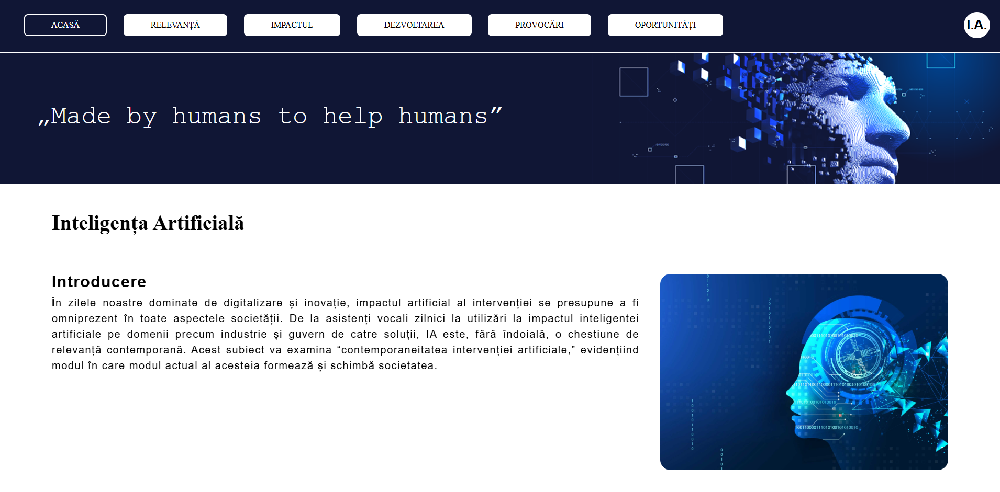

<h2 align="center">📘 Atestat – Inteligența Artificială</h2>

  
  
  
  

📅 Realizat în 📌 2024

---

## 🧠 Descrierea proiectului

Proiectul reprezintă un **Atestat de informatică HTML/CSS** care abordează tema **„Inteligența Artificială”**. Conținutul site-ului prezintă secțiuni importante despre IA: relevanța, impactul asupra societății, provocările și oportunitățile viitoare, toate explicate clar într-un format web simplu și accesibil.

---

## 🌐 Previzualizare

  

🔗 Live Demo: https://danislw.github.io/Atestat-AI/

*Poți accesa proiectul pe GitHub Pages la adresa de mai sus.*

---

## 🧩 Structura Proiectului

Site-ul este structurat pe mai multe secțiuni pentru a explica conceptul de inteligență artificială din diverse perspective:

- 📌 **Introducere** – Ce este inteligența artificială.
- 📊 **Relevanța contemporană** – Cum influențează IA diferite domenii moderne.
- 🤖 **Impactul asupra vieții umane** – Exemple de utilizări și efecte.
- 🚀 **Dezvoltarea tehnologiei** – Evoluția rapidă a sistemelor AI.
- ⚠️ **Provocări și controverse** – Aspecte etice, sociale și tehnice.
- 🌟 **Oportunități viitoare** – Posibile direcții de inovare.

---

## 🛠️ Tehnologii folosite

Acest proiect web a fost realizat cu:

- 🧱 **HTML5** – Structura paginii web  
- 🎨 **CSS3** – Stilizarea paginii și aspect vizual
- ⚡ **JavaScript (ES6)** – Funcționalitate dinamică și interactivitate

👉 Nu sunt utilizate șabloane externe, iar design-ul și logica aplicației sunt realizate integral de autor.

---

## 📄 Drepturi de autor și utilizare

Copyright (c) 2024 Datcu Daniel-Alexandru  
Toate drepturile rezervate.

Conținutul acestui repository, inclusiv codul sursă, designul și materialele
prezentate, nu pot fi copiate, modificate, distribuite sau utilizate în
niciun scop fără acordul prealabil, explicit și în scris al autorului.

